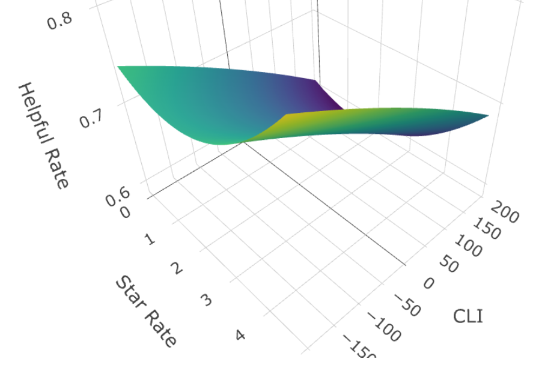
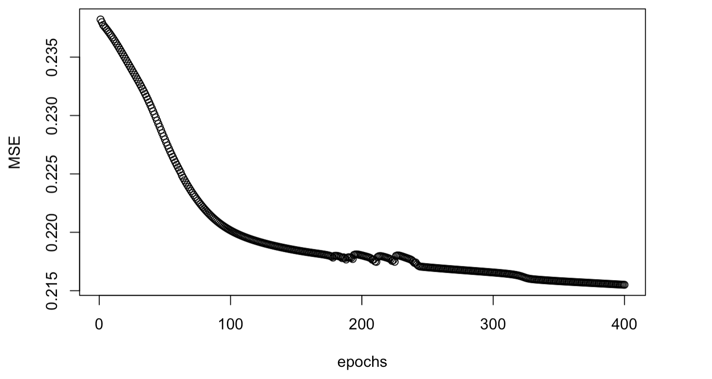

```{r setup, include=FALSE}
knitr::opts_chunk$set(echo = FALSE, message = FALSE, warning = FALSE)
library(knitr)
library(ggplot2)
library(tidyverse)
library(dplyr)
library(patchwork)
library(lubridate)
library(tidytext)
library(textdata)
library(tidyr)
library(plotly)
library(semPlot)
library(lavaan)
library(gmodels)
```

```{r}
hair_dryer = read.csv("hair_dryer.tsv", sep = "\t")
microwave = read.csv("microwave.tsv", sep = "\t")
pacifier = read.csv("pacifier.tsv", sep = "\t")
all = rbind(mutate(hair_dryer, group = "hair_dryer"), 
            mutate(microwave, group = "microwave"),
            mutate(pacifier, group = "pacifier"))
```

\newpage

\setcounter{page}{1}

\tableofcontents

\newpage

# Letter to the Marketing Director {-}

Dear Sunshine Company's Marketing Director:

Thanks for inviting us! We have performed an analysis based on the data you gave. The following are our analysis results and reasons.

- **You might consider push the hair dryer and pacifier to the market as soon as possible, but not microwave, which should be published later.**

Judging from the ratings, the number of five-stars in the hair dryer and pacifier customer ratings is much higher than other stars.But the microwave has the lowest five star rating ratio.Microwaves are search-type products, which have high requirements on rigid technology. Customers pay more attention to the rigid indicators of the product, and it is more difficult to get five star rating than the other two products.

As for time, the average score of hair dryer and pacifie has gradually increased with the passage of time, while the average score of microwave has gradually decreased first, reached a trough in 2012, and then gradually recovered. In general,  the market performance of microwave ovens is not stable enough.The other types of products currently have a good development trend, and are gradually recognized by more and more customers.Therefore, hair dryer and pacifier should enter the market as soon as possible and occupy market share.

But we need to more time to improve quality of microwave and find a good time to participate.

```{r}
dat = all
p1 = dat %>% 
  ggplot(aes(x = star_rating)) +
  geom_bar(stat = "count", fill = "#ff9900") +
  facet_grid(col = vars(group))
  
dat$review_date = mdy(dat$review_date)

p2 = ggplot(dat, aes(x = review_date, y = star_rating)) +
  geom_point(color = "#ff9900", alpha = 0.01, shape = 11) +
  scale_x_date() +
  geom_smooth(color = "#146eb4") +
  facet_grid(col = vars(group))
```

```{r fig.align="center",out.width="99%",fig.cap="Relationship between star rating and review date"}
p1 / p2
```

- **Please keep an eye on improving product ratings in the early stages of market entry.**

In the early stages of product release, customers cannot get product information from other channels, and they are bound to pay close attention to customer reviews. Through analysis, we found that the a growth in the number of 4 and 5 star ratings will increase the proportion of positive emotion words in the four categories of customer reviews, as shown in the figure.

```{r fig.align="center",out.width="99%",fig.cap="relationship between star rating and proportion of specific quality descriptors", fig.height= 3, fig.width=8}
nrc = read.csv("nrc.csv")
nrc_joy = nrc %>% 
  filter(sentiment == "joy" | sentiment == "trust" | sentiment == "surprise" | sentiment == "anticipation")

text_df = tibble(line = 1: nrow(hair_dryer), text = as.character(hair_dryer$review_body))
partial_df = text_df %>% 
  unnest_tokens(word, text) %>% 
  anti_join(stop_words) %>% 
  inner_join(nrc_joy) %>% 
  group_by(line) %>% 
  summarise(partial = n())
total_df = text_df %>% 
  unnest_tokens(word, text) %>% 
  anti_join(stop_words) %>% 
  inner_join(nrc) %>% 
  group_by(line) %>% 
  summarise(total = n())
tidy_df = partial_df %>% 
  inner_join(total_df, by = "line") %>% 
  mutate(proportion = partial / total)
regression = hair_dryer %>% 
  dplyr::select(star_rating) %>% 
  mutate(line = 1:nrow(hair_dryer)) %>% 
  left_join(tidy_df, by = "line")
regression = regression[-which(regression$proportion == 1),]
regression = na.omit(regression)
dat1 = regression %>% 
  mutate(group = "hair_dryer")
m1 = lm(star_rating ~ proportion, regression)

text_df = tibble(line = 1: nrow(microwave), text = as.character(microwave$review_body))
partial_df = text_df %>% 
  unnest_tokens(word, text) %>% 
  anti_join(stop_words) %>% 
  inner_join(nrc_joy) %>% 
  group_by(line) %>% 
  summarise(partial = n())
total_df = text_df %>% 
  unnest_tokens(word, text) %>% 
  anti_join(stop_words) %>% 
  inner_join(nrc) %>% 
  group_by(line) %>% 
  summarise(total = n())
tidy_df = partial_df %>% 
  inner_join(total_df, by = "line") %>% 
  mutate(proportion = partial / total)
regression = microwave %>% 
  dplyr::select(star_rating) %>% 
  mutate(line = 1:nrow(microwave)) %>% 
  left_join(tidy_df, by = "line")
regression = regression[-which(regression$proportion == 1),]
regression = na.omit(regression)
dat2 = regression %>% 
  mutate(group = "microwave")
m2 = lm(star_rating ~ proportion, regression)

text_df = tibble(line = 1: nrow(pacifier), text = as.character(pacifier$review_body))
partial_df = text_df %>% 
  unnest_tokens(word, text) %>% 
  anti_join(stop_words) %>% 
  inner_join(nrc_joy) %>% 
  group_by(line) %>% 
  summarise(partial = n())
total_df = text_df %>% 
  unnest_tokens(word, text) %>% 
  anti_join(stop_words) %>% 
  inner_join(nrc) %>% 
  group_by(line) %>% 
  summarise(total = n())
tidy_df = partial_df %>% 
  inner_join(total_df, by = "line") %>% 
  mutate(proportion = partial / total)
regression = pacifier %>% 
  dplyr::select(star_rating) %>% 
  mutate(line = 1:nrow(pacifier)) %>% 
  left_join(tidy_df, by = "line")
regression = regression[-which(regression$proportion == 1),]
regression = na.omit(regression)
dat3 = regression %>% 
  mutate(group = "pacifier")
m3 = lm(star_rating ~ proportion, regression)

dat = rbind(dat1, dat2, dat3)
dat %>% 
  ggplot(aes(x = proportion, y = star_rating)) +
  geom_point(color = "#ff9900", alpha = 0.04, shape = 11) + 
  geom_smooth(color = "#146eb4") +
  facet_wrap(vars(group))
# stargazer(m1, m2, m3, type = 'latex', title="Regression of star rating on proportion of specific quality descriptors")
```

In the structural equation modeling, we find that an increase in positive sentiment words will significantly improve product reputation, which indicates the future success.

- **Enhance specific products attributes to meet the customers need.**

We find out the most important words about the three types of products through our model, indicating that customers are very concerned about these aspects. Doing well in these aspects will greatly improve the competitiveness of the product.

```{r include=FALSE}
dat = read.csv("special_in_type.csv")

index = dat %>% 
  group_by(group, Attributes) %>% 
  summarise(tf_idf = sum(tf_idf) * 1000) %>% 
  group_by(group) %>% 
  mutate(Attributes = reorder(Attributes, tf_idf))

p1 = index %>% 
  filter(group == "hair dryer") %>% 
  mutate(Attributes = reorder(Attributes, tf_idf)) %>% 
  ggplot() +
  geom_col(aes(x = Attributes, y = tf_idf), fill = "#ff9900") +
  coord_flip() + 
  labs(title = "hair dryer", y = "Importent Index") +
  theme_minimal()

p2 = index %>% 
  filter(group == "microwave") %>% 
  mutate(Attributes = reorder(Attributes, tf_idf)) %>% 
  ggplot() +
  geom_col(aes(x = Attributes, y = tf_idf), fill = "#ff9900") +
  coord_flip() + 
  labs(title = "microwave", y = "Importent Index", x = NULL) +
  theme_minimal()

p3 = index %>% 
  filter(group == "pacifier") %>% 
  mutate(Attributes = reorder(Attributes, tf_idf)) %>% 
  ggplot() +
  geom_col(aes(x = Attributes, y = tf_idf), fill = "#ff9900") +
  coord_flip() + 
  labs(title = "pacifier", y = "Importent Index", x = NULL) +
  theme_minimal()
```

```{r echo=FALSE, fig.cap='The most importent attributes in the reviews of three commodities', warning=FALSE, out.width='99%', fig.height=3, fig.width=8}
p = (p1 + p2 + p3)
p
```

It can be seen from the figure that the first three concerns are as follows:

**Hair dryer:**

- brand: Customers are very concerned about the brand, so they need to enhance brand image and brand awareness
- product part: Focus on the quality of parts and improve product quality
- curl effect: Actively develop new technologies

**microwave:**

- heating food:Provides heating modes for different foods, making it easy for users to heat various foods
- related products :Co-organize promotional activities with manufacturers of related products such as refrigerators
- malfunction: Improve product quality and reduce the probability of failure

**pacifier:**

- place: Places for use of pacifiers: Customers are very concerned about whether pacifiers can be used by children such as newborn babies and teeth changing stages.
- related products: Can be sold with diapers and other products 
- character related: Breastfeeding women pay close attention to the condition of pacifiers because they are about to wean their children. This can improve the quality of pacifiers and place advertisements in specific groups.

\newpage

# Introduction

## Background

In recent years, online shopping has become an indispensable consumption mode in life. Online marketplaces such as Amazon have invested a considerable amount of resources in designing and improving the store interface, since online store interaction plays a signifificant role in the selection process. @HeijdenOnline

Customers use online review systems to evaluate goods or services sold by merchants. The move towards a read-write Web and the ability to provide more relevant information to consumers on online marketplaces has been also demonstrated to inflfluence the product choice process in electronic markets. @GodesProducts

Online review reflects the needs and preferences of customers and influences their purchase intentions. Due to the rapid development of online shopping, the number of online reviews has surged. How to get useful information from online reviews to help businesses make optimal decisions has become more and more important.For example,reviews closer to consensus may be considered more helpful by potential consumers than those exhibiting extremes of opinion. @SergentanisRe Nikolaos Korfifiatis explored the qualitative or textual characteristics of online consumer reviews. @KorfiatisUsing

This paper modeled and analyzed the variables in the review system, clarified the relationships between the variables, and screened out useful information, providing effective advice for Sunshine Company to enter the market.

## Our work

# Notation and Assumptions

\begin{table}[htbp]
\centering  % 表居中
\begin{tabular}{lccc}  % {lccc} 表示各列元素对齐方式，left-l,right-r,center-c
\hline
Symbol &Significance\\ \hline  % \hline 在此行下面画一横线
$\mathrm{f}$ &Frequceny \\         % \\ 表示重新开始一行
$\lambda$ &Wavelength \\        % & 表示列的分隔线
$\theta$ &Incidence angle \\ 
$\Delta h$ &Effective wave height\\ 
$\epsilon_{r} $ &Seawater relative dielectric constant\\ 
$\epsilon_{k}$ &Sea relative dielectric constant\\
$\mathrm{E}_{in}$ &Incident wave electric field strength\\
$\mathrm{E}_{out}$ &Reflected wave electric field strength\\
$\mathrm{f}_{d}$ &Doppler shift\\
$\mathrm{P}$ &Radio power\\ \hline
\end{tabular}
\caption{Nomenclature}
\end{table}

To establish our models, we made the following assumptions:

- **We assume that there is no difference between customers and they share the same preferences for the same characteristics of the product.** This allows us to extract user preferences based entirely on the dataset. While this assumption is not entirely realistic, we cannot consider the educational level of customers, different age groups, and other factors that cause differences in customer awareness and understanding of products in the data provided.

- **To further reduce external uncertainties, we do not consider the impact of changes in the market of alternative products and the macroeconomic cycle on these three types of commodities.** This allows our models to better study the characteristics of different products. Furthermore, this assumption simplifies our analysis and allows us to focus more on exploring the internal features of the dataset.

# Relationship between variables

## Descriptive statistics

```{r echo=FALSE, fig.align='center', fig.cap='Relationship between star rating and helpful votes rates or total votes', warning=FALSE, out.width='98%', fig.show='hold'}
dat = all
dat$vine = dat$vine %>% 
  fct_collapse(vine_Yes = c("Y", "y"), vine_No = c("N", "n"))
dat$verified_purchase = dat$verified_purchase %>% 
  fct_collapse(purchase_Yes = c("Y", "y"), purchase_No = c("N", "n")) 
dat = dat %>% 
  mutate(helpful_rate = NA)
for(i in 1:nrow(dat))
{
  if(dat$total_votes[i] != 0)
  {
    dat$helpful_rate[i] = dat$helpful_votes[i] / dat$total_votes[i]
  }
}
dat_helpful = dat
dat = dat %>% 
  na.omit() %>% 
  group_by(group, star_rating) %>% 
  summarise(average_helpful_rate = mean(helpful_rate), sum_total_votes = sum(total_votes))

p1 = dat %>% 
  ggplot(aes(x = star_rating, y = sum_total_votes)) +
  geom_col(position = "dodge", fill = "#ff9900") 

p2 = dat %>% 
  ggplot(aes(x = star_rating, y = average_helpful_rate)) +
  geom_col(position = "dodge", fill = "#146eb4") 

dat = dat_helpful
dat = dat %>% 
  na.omit() %>% 
  group_by(group, vine, verified_purchase, star_rating) %>% 
  summarise(average_helpful_rate = mean(helpful_rate), sum_total_votes = sum(total_votes))

p3 = dat %>% 
  ggplot(aes(x = star_rating, y = sum_total_votes)) +
  geom_col(aes(fill = group), position = "dodge") +
  facet_grid(cols = vars(verified_purchase), rows = vars(vine))

p4 = dat %>% 
  ggplot(aes(x = star_rating, y = average_helpful_rate)) +
  geom_col(aes(fill = group), position = "dodge") +
  facet_grid(cols = vars(verified_purchase), rows = vars(vine))

(p2 + p4) / (p1 + p3)
```

From the figure 1 we can see: Because the review rating uses a discrete scale range from1 to 5 stars, many reviewers who want to express their indifference will choose three stars (middle option). For example, when they analyzed online reviews of books on Amazon @LeePerceived, they found that  extreme ratings (1 star rating / 5 star rating) is more likely to resonate than indifference ratings (about 3 star rating). In other words, reviews that has more emotionally polar (only referring to either positive or negative aspects) are considered more helpful and have a greater impact on customers. This is also confirmed by the number of votes of each star rating. We found that although the star ratings are not much different in terms of recognition (usefulness in voting), but in terms of the total number of votes, one star rating and five star rating are obviously more, which shows that customers pay more attention to extreme reviews.

```{r fig.align="center",out.width="99%",fig.cap="Percentage of star rating in different categories of costomers"}
dat = all
dat$vine = dat$vine %>% 
  fct_collapse(vine_Yes = c("Y", "y"), vine_No = c("N", "n"))
dat$verified_purchase = dat$verified_purchase %>% 
  fct_collapse(Yes = c("Y", "y"), No = c("N", "n")) 
dat$star_rating = as.factor(dat$star_rating)

dat %>% 
  ggplot(aes(x = verified_purchase)) +
  geom_bar(aes(fill = star_rating), position = "fill") +
  facet_grid(cols = vars(vine)) +
  labs(y = "percentage")
```

From the perspective of vine, vine's purchase of products after trial is almost all 5 star ratings, while the proportion of 5 star ratings in non-vine's are significantly lower than vine. Because customers are invited to become Amazon Vine Voices based on the trust that they have earned in the Amazon community for writing accurate and insightful reviews. Therefore, the 5 star rating will be more.

## Reviews that triggered by a specific star rating

### Research ideas

Actually, in Amazon Mall, most customers browse through the rating results of previous customers before they comment, and then write their own comments.Each customer has a different experience on the same product, and the rating will also be different. When the customer browses the previous reviews, it is likely to be affected by the number of ratings of 5 levels. Therefore, we quantify this impact by the proportion of 5 ratings of all previous reviews that the customer viewed. So, how to measure the customer's review characteristics? In the text analysis, the emotion of the text is a commonly used text feature @HoSystemic, so we use the total emotion of review body as an indicator of the customer's review characteristics. Next, we use function fitting to explore the relationship between the two variables.

### Model construction and solution

As the model of three types of goods are in exactly the same way, we use the hair dryer as an example.

Processing *star rating* results of previous customers:

- **Classify the products of the hair dryer.** At Amazon Mall, a product may be sold in different stores, and customers can only comment under the store where they buy a product, so we define the same model products sold in the same store as one type. We classify the products in product_id.

- **Screen every category of hair dryer.** There are 538 types of hair dryers. Since the customer who first reviewed did not have any previous scoring results as a reference, we first selected products with at least 2 reviews.

- **Calculate the rating results of the $2^{nd}$ to nth customers browsing for each category of hair dryer.** In one category of hair dryer products, the $i^{th}$ customer is the research object. Calculate the number and proportion of different ratings in $i-1$ previous reviews.

The 1 star ratings ratio are as follows, and other star calculations are the same:

$$
HairRate1_{i}=\frac{HairSum1_{i}}{i-1}
$$

Gao Baojun found that in a system that does not classify ratings,because of fewer negative reviews and higher search costs, customers are more likely to see positive reviews, so positive reviews have a greater impact on customers.Because Amazon does not directly categorize its ratings, and the customer ratings of hair dryers are 4, 5 stars are much higher than other ratings. At this time, searching for low star ratings from many reviews is too expensive, so the impact of high ratings is significant. We add the 4 and 5 stars ratio in the customer reviews as the positive rate, the positive rate of the i-th customer ratei:

$$
rate_{i}=HairRate4_{i}+HairRate5_{i}
$$

- Then calculate the total  emotion in each comment of $2^{nd}$ to $n^{th}$ customers in each category. 

- Finally, function fitting to find the relationship between the two. A linear regression was carried out with R. The difference rate of the previous customer's rating per customer viewing in each product of the hair dryer is an independent variable and the total emotion of that customer's comment is a dependent variable.

$$
log(Sum_{i})=Rate_{i}+C
$$

The fitting results of the three goods are shown in the plot. ^[See Appendix for specific data.]

```{r fig.align="center",out.width="99%",fig.cap="Trend of total emotion with praise rate"}
dat = read.csv("2d_all_emotion.csv")

dat = dat%>% 
  mutate(rate = rate4 + rate5) %>% #--- 更改自变量
  filter(emotion > 0) %>% 
  mutate(log_emotion = log(emotion))

dat = dat[-which(dat$rate == 0),]
dat = dat[-which(dat$rate == 1),]

ggplot(dat, aes(x = rate, y = log_emotion)) + #--- x y 的参数调换可以更改 x y 轴
  geom_point(color = "#FF9900", alpha = 0.1) +
  geom_smooth(color = "#146eb4", method = lm) +
  facet_grid(col = vars(group))

dat_hair_dryer = dat %>% 
  filter(group == "hair_dryer")
m1 = lm(log_emotion ~ rate, data = dat_hair_dryer)

dat_microwave = dat %>% 
  filter(group == "microwave")
m2 = lm(log_emotion ~ rate, data = dat_microwave)

dat_pacifier = dat %>% 
  filter(group == "pacifier")
m3 = lm(log_emotion ~ rate, data = dat_pacifier)
```

\begin{table}[!htbp] \centering 
  \caption{Regression of Y on X for three products} 
  \label{} 
\begin{tabular}{@{\extracolsep{5pt}}lccc} 
\\[-1.8ex]\hline 
\hline \\[-1.8ex] 
 & \multicolumn{3}{c}{\textit{Dependent variable:}} \\ 
\cline{2-4} 
\\[-1.8ex] & \multicolumn{3}{c}{log\_emotion} \\ 
\\[-1.8ex] & (1) & (2) & (3)\\ 
\hline \\[-1.8ex] 
 rate & 1.222$^{***}$ & $-$0.262$^{**}$ & 5.048$^{***}$ \\ 
  & (0.102) & (0.114) & (0.108) \\ 
  & & & \\ 
 Constant & 4.654$^{***}$ & 4.859$^{***}$ & 0.757$^{***}$ \\ 
  & (0.078) & (0.075) & (0.087) \\ 
  & & & \\ 
\hline \\[-1.8ex] 
Observations & 9,978 & 1,303 & 8,651 \\ 
R$^{2}$ & 0.014 & 0.004 & 0.202 \\ 
Adjusted R$^{2}$ & 0.014 & 0.003 & 0.202 \\ 
Residual Std. Error & 1.230 (df = 9976) & 1.025 (df = 1301) & 1.383 (df = 8649) \\ 
F Statistic & 143.482$^{***}$ & 5.298$^{**}$ & 2,192.962$^{***}$ \\ 
\hline 
\hline \\[-1.8ex] 
\textit{Note:}  & \multicolumn{3}{r}{$^{*}$p$<$0.1; $^{**}$p$<$0.05; $^{***}$p$<$0.01} \\ 
\end{tabular} 
\end{table}

The trend of the total emotion changes of the three goods is different, due to the different types of goods. In online shopping, products are classified as search products and experience products. Search products can obtain information about quality before using,but experience products must be use to assess product quality.The impact of different product types of ratings varies.Pacifier is an experience product. It must be used to evaluate product quality, so it is subjective and customers are more likely to be affected by other customer ratings. As the positive rate increases, customers are significant influenced and more willing to express their feelings about a good. Microwave is a search-type product. Customers can accurately evaluate the quality through specific parameters before purchasing. It is so objective that customers are not easily affected by other customer ratings,so it is almost a horizontal straight line. The type of the hair dryer is between the microwave and pacifier, so the positive rate of other customers will have a certain impact on the total emotion of the review.Of course, the impact is lower than that of pacifier.

## Relationship between *Star rating* and specific emotion words

we explored whether descriptive words of specific nature in the review would be highly relevant to the rating. First of all, we will divide comments into words and find the content of word segmentation .The operation is the same as the first subsection. And then we calculate the sum of joy,trust ,surprise and anticipation emotions in each comment. Furthermore, the ratio of the number of these four types of emotional words in each comment to the total number of emotional words in that comment is taken as independent variable, and the rating of each comment is taken as dependent variable.We draw figures of three data sets. 

```{r fig.align="center",out.width="99%",fig.cap="relationship between star rating and proportion of specific quality descriptors"}
nrc = read.csv("nrc.csv")
nrc_joy = nrc %>% 
  filter(sentiment == "joy" | sentiment == "trust" | sentiment == "surprise" | sentiment == "anticipation")

text_df = tibble(line = 1: nrow(hair_dryer), text = as.character(hair_dryer$review_body))
partial_df = text_df %>% 
  unnest_tokens(word, text) %>% 
  anti_join(stop_words) %>% 
  inner_join(nrc_joy) %>% 
  group_by(line) %>% 
  summarise(partial = n())
total_df = text_df %>% 
  unnest_tokens(word, text) %>% 
  anti_join(stop_words) %>% 
  inner_join(nrc) %>% 
  group_by(line) %>% 
  summarise(total = n())
tidy_df = partial_df %>% 
  inner_join(total_df, by = "line") %>% 
  mutate(proportion = partial / total)
regression = hair_dryer %>% 
  dplyr::select(star_rating) %>% 
  mutate(line = 1:nrow(hair_dryer)) %>% 
  left_join(tidy_df, by = "line")
regression = regression[-which(regression$proportion == 1),]
regression = na.omit(regression)
dat1 = regression %>% 
  mutate(group = "hair_dryer")
m1 = lm(star_rating ~ proportion, regression)

text_df = tibble(line = 1: nrow(microwave), text = as.character(microwave$review_body))
partial_df = text_df %>% 
  unnest_tokens(word, text) %>% 
  anti_join(stop_words) %>% 
  inner_join(nrc_joy) %>% 
  group_by(line) %>% 
  summarise(partial = n())
total_df = text_df %>% 
  unnest_tokens(word, text) %>% 
  anti_join(stop_words) %>% 
  inner_join(nrc) %>% 
  group_by(line) %>% 
  summarise(total = n())
tidy_df = partial_df %>% 
  inner_join(total_df, by = "line") %>% 
  mutate(proportion = partial / total)
regression = microwave %>% 
  dplyr::select(star_rating) %>% 
  mutate(line = 1:nrow(microwave)) %>% 
  left_join(tidy_df, by = "line")
regression = regression[-which(regression$proportion == 1),]
regression = na.omit(regression)
dat2 = regression %>% 
  mutate(group = "microwave")
m2 = lm(star_rating ~ proportion, regression)

text_df = tibble(line = 1: nrow(pacifier), text = as.character(pacifier$review_body))
partial_df = text_df %>% 
  unnest_tokens(word, text) %>% 
  anti_join(stop_words) %>% 
  inner_join(nrc_joy) %>% 
  group_by(line) %>% 
  summarise(partial = n())
total_df = text_df %>% 
  unnest_tokens(word, text) %>% 
  anti_join(stop_words) %>% 
  inner_join(nrc) %>% 
  group_by(line) %>% 
  summarise(total = n())
tidy_df = partial_df %>% 
  inner_join(total_df, by = "line") %>% 
  mutate(proportion = partial / total)
regression = pacifier %>% 
  dplyr::select(star_rating) %>% 
  mutate(line = 1:nrow(pacifier)) %>% 
  left_join(tidy_df, by = "line")
regression = regression[-which(regression$proportion == 1),]
regression = na.omit(regression)
dat3 = regression %>% 
  mutate(group = "pacifier")
m3 = lm(star_rating ~ proportion, regression)

dat = rbind(dat1, dat2, dat3)
dat %>% 
  ggplot(aes(x = proportion, y = star_rating)) +
  geom_point(color = "#ff9900", alpha = 0.04, shape = 11) + 
  geom_smooth(color = "#146eb4") +
  facet_wrap(vars(group))
# stargazer(m1, m2, m3, type = 'latex', title="Regression of star rating on proportion of specific quality descriptors")
```

As shown in the figure, the smooth fitting curve has a clear trend. As the proportion of these four emotions increased, so did the rating. These four types of emotions are positive emotions, so the more such emotions in the comments indicate that customers are satisfaction with the product, and ratings are higer too.

\begin{table}[!htbp] \centering 
  \caption{Regression of star rating on proportion of specific quality descriptors for three products} 
  \label{} 
\begin{tabular}{@{\extracolsep{5pt}}lccc} 
\\[-1.8ex]\hline 
\hline \\[-1.8ex] 
 & \multicolumn{3}{c}{\textit{Dependent variable:}} \\ 
\cline{2-4} 
\\[-1.8ex] & \multicolumn{3}{c}{star\_rating} \\ 
\\[-1.8ex] & (1) & (2) & (3)\\ 
\hline \\[-1.8ex] 
 proportion & 2.108$^{***}$ & 2.948$^{***}$ & 1.615$^{***}$ \\ 
  & (0.087) & (0.279) & (0.063) \\ 
  & & & \\ 
 Constant & 3.202$^{***}$ & 2.061$^{***}$ & 3.553$^{***}$ \\ 
  & (0.041) & (0.131) & (0.031) \\ 
  & & & \\ 
\hline \\[-1.8ex] 
Observations & 7,988 & 1,195 & 14,540 \\ 
R$^{2}$ & 0.069 & 0.086 & 0.043 \\ 
Adjusted R$^{2}$ & 0.069 & 0.085 & 0.043 \\ 
Residual Std. Error & 1.246 (df = 7986) & 1.594 (df = 1193) & 1.149 (df = 14538) \\ 
F Statistic & 590.479$^{***}$ & 112.051$^{***}$  & 657.771$^{***}$  \\ 
\hline 
\hline \\[-1.8ex] 
\textit{Note:}  & \multicolumn{3}{r}{$^{*}$p$<$0.1; $^{**}$p$<$0.05; $^{***}$p$<$0.01} \\ 
\end{tabular} 
\end{table} 

We then perform linear regression on the three datasets respectively. As we can see, since the rating is integer, the $R^{2}$ of the model is quite small. But the coefficients obtained by fitting are very significant, and passed the F-test test.

# Identify useful reviews

## Research ideas

A text feature analysis of the review content is not limited to ratings and text length. Usually when analyzing comments, it is difficult to analyze from the content, but we introduced CLI, total emotion, and product keyword analysis, and conducted a full analysis in terms of text readability, emotional characteristics, and text keywords.

```{r fig.align="center",out.width="60%",fig.cap="Identify useful comments"}
include_graphics("fig1.png")
```

There is a lot of information in the online review system of online store, and the online store owners often want to analyze the information in the online review system to know more about the customers and adjust their products to promote the increase of sales volume. However, many reviews have no impact on customers, and we call it useless evaluation. Some reviews will have a great impact on customers, and then affect sales volume, called useful evaluation.

Only by finding useful evaluation and analyzing it can Sunshine Company accurately grasp customer preferences and make correct adjustment directions in time. When new products enter the market, comments are published recently and need some time to be viewed by fewer people ,so their HRs are not accuracy enough. However, in order to improve the product as soon as possible, we should find useful comments accurately without knowing the accuracy HR by analyzing some characteristics of the comments. In this way, Sunshine Company can analyze and make optimization decisions as soon as possible.


## Model Establishing

In order to measure the usefulness of a comment, we measure it by the helpful votes ratio of goods :

$$
HR=\frac{FelpfulVotes}{TotalVotes}
$$

Informativeness is a feature of comments. We use the CLI to measure the amount of information contained in each review and accurately measure the information status of each review.The Coleman–Liau Index @ColemanA has been developed specififically for machine-based scoring. The following formula describes the Coleman–Liau index:

$$ 
CLI=5.89\times\frac{characters}{words}+\frac{sentences}{word}-15.8
$$

The CLI indicates the readability of the comments. The smaller the CLI, the simpler and easier to understand the comment, and the higher the CLI, the more complex the comment.
Combined with star ratings, through the relationship between these variables, useful reviews can be effectively identified to help Sunshine Company to make judgments.
We assume that CLI and rating are not simple linear relation.So we introduce quadratic term in the regression model.

$$ 
HR=\beta_{1}CLI+\beta_{2}CLI^{2}+\beta_{3}StarRating+\beta_{4}StarRating^{2}+C
$$

## Model Result

```{r fig.align="center",out.width="60%",fig.cap="Relationship between StarRating, CLI and HR"}

```

```{r}
dat = read.csv("one_all.csv", stringsAsFactors = FALSE)
names(dat)[4] = "star_rating"
dat$CLI = dat$CLI%>% 
  as.numeric() 
dat = dat %>% 
  mutate(star_rating_square = star_rating^2) %>% 
  mutate(time_difference_log = log(time_difference)) %>% 
  mutate(emotion_polarity_square = emotion_polarity^2) %>% 
  mutate(emotion_total_square = emotion_total^2) %>% 
  mutate(CLI_square = CLI^2)
dat = na.omit(dat)
m <- lm(HR ~ CLI + CLI_square + star_rating + star_rating_square, data = dat)
sum = summary(m)
sum$coefficients %>% 
   kable(caption = "Regression Coefficients for the regression model", digits = 2)
```

The regression results are shown in the table. The quadratic terms of the CLI and StarRating's  coefficients pass the hypothesis test and were significantly different from 0, indicating that the CLI and StarRating have a significant impact on HR. The absolute value of the quadratic term coefficient of StarRating is larger than that of CLI. 

With the change of StarRating, HR will change more obviously. It can also be seen from the figure that the HR is larger at 1 and 5 star rating and smaller at 3 star rating, so the reviews corresponding to the 1 and 5 star ratings are more likely to be vusdful reviews. 

With the increase of the CLI, the HR increases first and then decreases. When the comment is too simple, it contains less information and the comment is not very useful.When the comment contains too complicated information, it is difficult for customers to process, which will also reduce the usefulness of the comment. But the coefficient of the quadratic terms of the CLI is too small, the change trend is slow.Therefore, it is only when the reviews are extremely simple or extremely complex that they can lead to a significant decrease in the usefulness of the reviews.

# GD, SGD and Neural Network

## Logit model based on GD and SGD optimization methods

### Model Establishing

Suppose we have independent training samples {(x1, y1), (x2, y2), ..., (xn, yn)}, y = {0, 1}. The probability that each observed sample (xi, yi) occurs is:

$$P\left(\mathrm{y}_{i}, \mathrm{x}_{i}\right)=P\left(\mathrm{y}_{i}=1 | \mathrm{x}_{i}\right)^{y_{i}}\left(1-P\left(\mathrm{y}_{i}=1 | \mathrm{x}_{i}\right)\right)^{1-y_{i}}$$

Then the likelihood function for our entire sample set, in which there are n independent samples:

$$L(\theta)=\prod P\left(\mathrm{y}_{i}=1 | \mathrm{x}_{i}\right)^{y_{i}}\left(1-P\left(\mathrm{y}_{i}=1 | \mathrm{x}_{i}\right)\right)^{1-y_{i}}$$

Then, the maximum likelihood function is called **cost function**.
^[The key of applying maximum likelihood method is to find the value $\theta$ of the coefficient that maximizes the likelihood function in the model.]

### Model solving

The derivative of $L(\theta)$ with respect to $\theta$ is:

$$\frac{\partial L(\theta)}{\partial \theta}=\sum_{i=1}^{n} y_{i} x_{i}-\sum_{i}^{n} \frac{e^{\theta^{T} x_{i}}}{1+e^{\theta_{x_{i}}}} x_{i}=\sum_{i=1}^{n}\left(y_{i}-\sigma\left(\theta^{T} x_{i}\right)\right) x_{i}$$

For this function, we can **not** easily find the derivatives. So we use the properties of the gradient descent method @WangBaoBin , then:

$$\theta^{t+1}=\theta^{t}-\alpha \frac{\partial L(\theta)}{\partial \theta}=\theta^{t}-\alpha \sum_{i=1}^{n}\left(y_{i}-\sigma\left(\theta^{T} x_{i}\right)\right) x_{j}$$

We normalize each variable before training. Then, we set the learning rate to be gradually decreasing for training.

$$\frac{\partial L(\theta)}{\partial \theta}=\sum_{i=1}^{n} y_{i} x_{i}-\sum_{i}^{n} \frac{e^{\theta^{T} x_{i}}}{1+e^{\theta_{x_{i}}}} x_{i}=\sum_{i=1}^{n}\left(y_{i}-\sigma\left(\theta^{T} x_{i}\right)\right) x_{i}$$

```{r echo=FALSE}
alpha = function(x)
{
  if(x<100)
  {
    return(1/exp(x)/100)
  }
  else
  {
    return(1/exp(100))
  }
}
```

```{r echo=FALSE, fig.align='center', fig.cap='Decreasing learning rate function and Sigmoid function', warning=FALSE, out.width='40%', fig.show='hold'}
curve(alpha, from = 1, to = 50, n = 100, add = FALSE, type = "l", xlab = 'epochs', ylab = 'learn_rate')
curve(1/(1+exp(-x)), from = -6, to = 6, n = 100, add = FALSE, type = "l", xlab = 'x', ylab = 'y')
```

## Neural network model based on SGD optimization method

### Model establishing

#### Neurons

A neuron is the basic unit of a neural network. @Chua1988Cellular The neuron first takes input and then performs some mathematical operations before producing an output. @ZhuangZhenQuan

For a two-input neuron, the output steps are:
First multiply the two inputs by the weights. Add the two results and add an bias. Finally process them through the activation function to get the output.

$$y = f(x1 × w1 + x2 × w2 + b)$$

We choose the sigmoid function as the activation function of the neural network.

$$S(x) = \frac{1}{1 + e^{-x}}$$

$$S'(x) = \frac{e^{-x}}{(1 + e^{-x})^2} = S(x)(1-S(x))$$

#### Neural Networks

Considering the limitation of the computing resources, we build a simple neural network. It contains 2 inputs, a hidden layer with 2 neurons (h1 and h2) , and an output layer (o1) with 1 neuron. 
@YanPingFan 

#### Feedforward and Loss

The process of passing the input of a neuron forward to obtain the output is called feedforward.

Before training a neural network, we need to have a standard definition so that we can make improvements. We use the mean square error (MSE) to define the loss:

$$ MSE = \frac{1}{n} \sum_{i=1}^n (y_{true} - y_{pred}) $$

We only use one sample at a time during training, so the loss function is:

$$ \begin{aligned} \mathrm{MSE} &=\frac{1}{1} \sum_{i=1}^{1}\left(y_{t r u e}-y_{p r e d}\right)^{2} \\ &=\left(y_{t r u e}-y_{p r e d}\right)^{2} \\ &=\left(1-y_{p r e d}\right)^{2} \end{aligned} $$

### Model solving

#### Training neural network

The process of training a neural network is to minimize the loss. The lower the loss, the better the prediction result.

Since the predicted value is calculated by a series of network weights and biases, the loss function is actually a multivariate function depending on multiple weights and biases:

$$L\left(w_{1}, w_{2}, w_{3}, w_{4}, w_{5}, w_{6}, b_{1}, b_{2}, b_{3}\right)$$

Derivative chain rule: (take w1 as an example)

$$\frac{\partial L}{\partial w_{1}}=\frac{\partial L}{\partial y_{p r e d}} * \frac{\partial y_{p r e d}}{\partial h_{1}} * \frac{\partial h_{1}}{\partial w_{1}}$$

This system using backward calculation of partial derivatives is called reverse conduction.

#### SGD optimization method

We use the stochastic gradient descent (SGD) optimization algorithm @WangGongPeng based on convolutional neural networks to gradually optimize the weight $w$ and bias $b$  so that the loss function will be slowly decreased, thereby improving our neural network. Take $w_1$ as an example:

$$w_{1} \leftarrow w_{1}-\eta \frac{\partial L}{\partial w_{1}}$$

```{r echo=FALSE, fig.align='center', fig.cap='Schematic diagram of the built neural network', out.width='80%'}
knitr::include_graphics("Schematic diagram of the built neural network.png")
```

```{r echo=FALSE, fig.align='center', fig.cap='Variation of MSE with the number of iterations', out.width='60%'}

```

#### Initialization of weight

The initialization of the weights and biases of the nodes in the neural network follows the standard normal distribution.

$$ Weight_i,Bias_i \sim N(0,1)$$

### Model results

From the results, as the number of iterations increases, the mean square error first decreases rapidly, and then stabilizes.

### Cross validation

We use *total emotion* and *square of star rating* to predict *helpful rate*.

Using systematic sampling, we divided the data set into three groups for cross-validation. ^[Time consuming differences due to computer hardware levels and temperature conditions. For reference only]

```{r}
dat_time = read.csv("dat_time.csv")
dat_correct = read.csv("dat_correct.csv")
dat_time = dat_time[1:3, 2:5]
dat_correct = dat_correct[1:3, 2:5]
colnames(dat_time) = c("Method", "Cross Validation 1", "Cross Validation 2", "Cross Validation 3")
colnames(dat_correct) = c("Method", "Cross Validation 1", "Cross Validation 2", "Cross Validation 3")
kable(dat_time, caption = "Time Consuming (s)", digit = 2)
```

```{r}
kable(dat_correct, caption = "Correct Rate", digit = 2)
```

# Track the real utility of customers

## Research ideas

```{r echo=FALSE, fig.align='center', fig.cap='research idea of tracking the real utility', out.width='60%'}
include_graphics("fig2.png")
```

Rating reflects the utility of the customer. However, rating standards vary from person to person. For example, some people think that 3 stars represent average satisfaction, while others think that 3 stars can shows their strong dissatisfaction. It can be seen that customers with different utility share the same rating based on different scoring criteria, and the information indicated by ratings and reviews is not completely consistent.  Rating may cause deviations in the utility measurement due to the different personal rating standards of the customers and the discrete scale of scoring. Therefore, by establishing a suitable model and using the information in reviews to calculate their real utility, Sunshine Company can analyze it. Our model's principle is to quantify the information contained in the review and return to a score. And with the multiple regression, we can comprehensively consider the rating standards of all customers and build a market preference patterns. And then recalculate the corresponding score of each review. Finally, we match score with customer rating to ensure the correctness of our model.And the score reflect customers true attitude toward the product.

We will first build a model that extracts product features based on customer reviews of the product, and then build a market utility measurement model based on the extracted features.

## Feature extraction

In order to take into account all the factors affecting the utility in the review, we use tf-idf model to extract the features of the review. It's a numerical statistic that is intended to reflect how important a word is to a review in our dataset. And then we can extract the feature matrix. 

$Feature\in\mathbb{R}^{\mathbb{m}\times\mathbb{n}}$ can be summarized as follows:

$$
\operatorname{tfidf}(t, d, D)=TF \cdot IDF \cdot I_{d\in nrc}
$$

Now, we will look at what each of these terms represent.

### Calculate TF

$tf$ is an abbreviation for ”Term frequency”. $TF$ indicates how often $t$appears in $d$. Here we assume that "review_body" is a detailed discription of "review_head", thus we extract review features only in "review_body". Meanwhile, the "review" mentioned in the following refers to "review_body"  by default.

A larger $TF$ means more occurences of t in the review d.

```{r} 
options(knitr.kable.NA = '')
data.frame(latent = c("reputation",NA,"review", NA, NA, "mark", NA, "type of customer", NA), 
           measurement = c("dif_star","dif_review","emotion", "CLI", "positive", "star", "score", "vine","verified"),
           explanation = c("Increase of mean star rating every year ","Increase of number of reviews every year","Total emotion","Readability of text","Number of positive emotion words","Actual ratings in the dataset","Quantitative real utility from reviews","Yes / No Amazon vine member","Yes / No Verified purchase")) %>% 
kable(caption = "Latent variables and Measurements") 
```

### Calculate IDF

$idf$ is the abbreviation for ”Inverse document frequency". It's a measure of how much information the word provides in a review. We calculate $IDF$ as:

$D$ shows a set including all reviews in a data set. $N$ indicates the total number of reviews included by $D$. From the formula we can see that when a word in one review appears more often in other reviews, $ IDF$ will become smaller, which means that the word is more common.

$TF \cdot IDF$ measures the weight of each word in a review, so that each reviews can be represented by a vector.

### Illustrative Function

This is an illustrative function. $I_{d\in nrc}$ is given by:
$$
I_{d\in nrc}=\left\{\begin{array}{ll}
	1 & , d \in nrc \\
	0 & , d \notin nre
	\end{array}\right.
$$

$nrc$ refers to “NRC Emotion Lexicon”. It’s a list of English words and their associations with eight basic emotions (anger, fear, anticipation, trust, surprise, sadness, joy, and disgust) and two sentiments (negative and positive).
Here we assume that sentimental words are the jey factor that affects the customer's rating, which will help us avoid the interference of meaningless words on review features. It makes sense because the evaluation of the product can not avoid using the emotional words such as "good" or "bad.

In fact, as we solve our model, we find that this assumption does not result in the component elements of the vector representing the reviews to be all 0, which means that all valid reviews carry at least one word in nrc. We also verified this in the two data sets *hair_dryer* and *microwave.tsv*

## Construction of Customer Utility Function

We believe that the utility of a product depends on the customer's personal preference and the characteristics of the product. Our model for customer utility is summarized as:
$$u(s, c)= score (Content (s), ContentBasedProfile(c))$$

$ Content (s) $ is a matrix describing product characteristics based on content. That is $Freature\in\mathbb{R}^{m\times n}$, calculated in the previous model. $ ContentBasedProfile (c) $ is a measure of customer preference. Based on our customer homogeneity assumption that customer preference patterns represents market preference partterns. So we define the vector representing market preference as $Preference\in\mathbb{R}^{n\times 1}$.Customer utility can be further expressed as:
$$U= Feature \cdots Preference $$

We consider the star rating given by customers in the data set as a reflection of the customer's utility. The significance of this is to let our model learn the characteristics of different ratings from reviews, In this way, both $ U $ and $ Feature $ are known, and the customer's customer preference , which is also referred to the market preference, can be quantified by the least square method.

## Model Result

We split the data into training and testing sets according to a  4: 1 ratio. Take "pacifier.tsv" as an example. Before extracting the reviews feature, we clean the data set by dropping two rows with null value.Then wr calculate $ Feature $ matrix .The shape of the $ Feature $ matrix is (18937, 16413), of which there are 2366 words in $ nrc $. Delete the rows with all 0. The shape of the matrix has not changed. This validates our hypothesis that sentimental words vocabulary is a key factor affecting ratings. The key words we have selected through feature extraction are shown in the figure.

```{r fig.align="center",out.width="99%",fig.cap="The most important words in the review of three products"}
bing = get_sentiments("bing")
bing$sentiment[which(bing$word == "cheap")] = "positive"

text_df = tibble(line = 1: nrow(hair_dryer), text = as.character(hair_dryer$review_body))
tidy_df = text_df %>% 
  unnest_tokens(word, text) %>% 
  anti_join(stop_words)

bing_word_counts <- tidy_df %>%
  inner_join(bing) %>%
  count(word, sentiment, sort = TRUE) %>%
  ungroup() %>% 
  bind_tf_idf(word, sentiment, n)

p1 = bing_word_counts %>%
  group_by(sentiment) %>%
  top_n(10) %>%
  ungroup() %>%
  mutate(word = reorder(word, tf_idf)) %>%
  ggplot(aes(word, tf_idf, fill = sentiment)) +
  geom_col(show.legend = FALSE) +
  facet_grid(row = vars(sentiment), scales = "free_y") +
  labs(y = "tf-idf", x = NULL, title = "hair_dryer") +
  theme(plot.title = element_text(hjust = 0.5)) +
  coord_flip()

text_df = tibble(line = 1: nrow(microwave), text = as.character(microwave$review_body))
tidy_df = text_df %>% 
  unnest_tokens(word, text) %>% 
  anti_join(stop_words)

bing_word_counts <- tidy_df %>%
  inner_join(bing) %>%
  count(word, sentiment, sort = TRUE) %>%
  ungroup() %>% 
  bind_tf_idf(word, sentiment, n)

p2 = bing_word_counts %>%
  group_by(sentiment) %>%
  top_n(10) %>%
  ungroup() %>%
  mutate(word = reorder(word, tf_idf)) %>%
  ggplot(aes(word, tf_idf, fill = sentiment)) +
  geom_col(show.legend = FALSE) +
  facet_grid(row = vars(sentiment), scales = "free_y") +
  labs(y = "tf-idf", x = NULL, title = "microwave") +
  theme(plot.title = element_text(hjust = 0.5)) +
  coord_flip()

text_df = tibble(line = 1: nrow(pacifier), text = as.character(pacifier$review_body))
tidy_df = text_df %>% 
  unnest_tokens(word, text) %>% 
  anti_join(stop_words)

bing_word_counts <- tidy_df %>%
  inner_join(bing) %>%
  count(word, sentiment, sort = TRUE) %>%
  ungroup() %>% 
  bind_tf_idf(word, sentiment, n)

p3 = bing_word_counts %>%
  group_by(sentiment) %>%
  top_n(10) %>%
  ungroup() %>%
  mutate(word = reorder(word, tf_idf)) %>%
  ggplot(aes(word, tf_idf, fill = sentiment)) +
  geom_col(show.legend = FALSE) +
  facet_grid(row = vars(sentiment), scales = "free_y") +
  labs(y = "tf-idf", x = NULL, title = "pacifier") +
  theme(plot.title = element_text(hjust = 0.5)) +
  coord_flip()

p1 + p2 + p3
```

Next, we use the least squares regression on the training set to obtain the market preference, and the value of RMSE is 1.27.

To further explore the effectiveness of the model, we predict the real utility of customers based on the characteristics of the reviews on the test set, and calculate the matching degree of the model on the test set. Since we use the multiple regression to calculate the market preference.As the star rating that represents the utility of the customer in the data set is considered to be a discrete variable. We think the error is acceptable within 1 star. The matching degree is 85.35%. The comparison data between the real utility value and the rating is as follows:

In dataset *hair_dryer* and *microwave*, it is also found that the $ Feature $ matrix has no row elements that are all 0. The RMSE of the model is 1.50 and 2.14, and the matching degrees are 85.35% and 77.09%, respectively.

The real utility obtained by our model is close to the ratings of most customers, which shows that the market rating standards constructed by this model are indeed a comprehensive processing and averaging result of all customer rating standards, and can represent the overall rating standards of customers. At the same time, about 20% of customers did not match the real utility, indicating that this customer ’s rating standard is seriously deviating from the market rating standard, and the rating is inaccurate. It better reflects the relationship between product characteristics and the user's real utility.


# Product Reputation and Potential Successful Product

## Model Establishing

We want to measure reputation, which is difficult since it can not be seen or captured using a single 
method. We decide to measure this latent variable “reputation” by two new variables. These 
new variables have the advantage of being more clearly defifined. And then, we add another two factors to be the regressors. 

## Model Solving

Using factor analysis, we try to solve a problem: there are variables that we want to measure, but we can not directly observe them, which are called latent variables. These can typically be rather complex variables, such as quality of life or general mental ability. Structural equation  model (SEM) is a tool that can be used to try to measure these latent variables. We try to explain the variation in the unexplained, latent variables (factors), using observed, correlated variables. 

Measurement part:
- Factor model for the endogenous variables
- Factor model for the exogenous variables

Structural part:
- Model implied by theory

### Measurement part

Factor model for the endogenous variables - y as a function of latent variables $\eta$ :

$y_q = \alpha^{y}_{q1 \eta_{1}} + \alpha^{y}_{q2 \eta_{2}} + ... \alpha^{y}_{qs \eta_{s}} + \epsilon_{q}$ 

Factor model for the endogenous variables - x as a function of latent variables $\xi$ :

$y_q = \alpha^{x}_{p1 \xi_{1}} + \alpha^{x}_{p2 \xi_{2}} + ... \alpha^{x}_{ps \xi_{s}} + \epsilon_{p}$ 

Interpretation for factor loadings - standardize V(yi) = 1 and V($\eta$) = 1, then the OLS estimator 
$$\hat{\alpha} = (Cov(y, \eta)/V(\eta)) = \rho_{y, \eta}$$
and

$$V(\eta) = \hat{\alpha}^2 V(\eta) + V(\eta)$$
$$1 = \hat{\alpha}^2 + V(\eta)$$

$\hat{\alpha}^2$ is the proportion of the variance of y originating from the factor $\eta$
and $1-\hat{\alpha}^2$ from the error.

### Structural Part

The structural part consists of a regression model for each dependent latent variable as a function of:
- Other dependent latent variables, endogenous, $\eta$
- Latent exogenous variables, $\xi$

$$\eta_{s} = \beta_{s1}\eta_{1} + \beta_{s2}\eta_{2} + ... + \beta_{ss-1}\eta_{s-1} + \gamma_{s1}\xi_{1} + \gamma_{s2}\xi_{2} + \gamma_{sr}\xi_{r} + \zeta_{s}$$

```{r echo=FALSE, fig.align='center', fig.cap='Structrual Equation Model Outcome', out.width='80%'}
include_graphics("sem.png")
```

It can be seen from the figure that the circle represents the factor and the square represents the measurement index. The number on the line is the regression coefficient. (The number is 0 because the coefficient is small and not shown intact.) . It can be seen from the figure that the more positive emotion words in the review, the higher the product's reputation. The higher the customer ’s true utility in the rating, the higher the customer ’s satisfaction with the product and the higher the product ’s reputation. Among the customer types, the more customers of the vertified type indicate that many customers are willing to purchase the product, which is a recognition of the product quality and an increase in reduction. The decrease of positive sentiment words in the product reviews, the decrease of customer's true utility, and the decrease number of customers of the vertified type indicate that the reduction of such products will gradually decrease.

## Product Forecast

From the above analysis, it can be known that the CLI in each type of product reviews, the number of positive sentiment words, the true utility, and proportion of customers belonging to the verified category have a significant impact on the product ’s reputation .The product ’s reputation continues to increase.Have development potential. It shows that this product has development potential and is a potential successful product. Otherwise, it is a potential failed product. Therefore, attention should be paid to the changes in these four indicators.
It is predicted whether the number of reviews of the product will increase or decrease in the next year, and based on this, it is judged whether the product's reputation is increasing or decreasing. At the same time, we believe that products that increase in the next year can be regarded as potential successful products, and products that decrease in the next year can be regarded as potential failure products.

# Strengths and Weaknessess

## Strengths

1. **The analysis of the review content is not limited to ratings and text length.** We introduced CLI, total emotion, and product keyword analysis, and conducted a full analysis in terms of text readability, emotional characteristics, and text keywords.

2. **The models are rich and the effects are significant.** We not only introduce basic models such as regression, structural equation models, etc., but also construct our own models to calculate the real utility, and analyze the data more accurately from multiple angles.

## Weaknessess

1. In the analysis of the data, the control variables of the regression were not considered comprehensively. Multiple regression models should be tried to select better results.

# References {-}

<div id="refs"></div>

\newpage

# Appendix {-}

