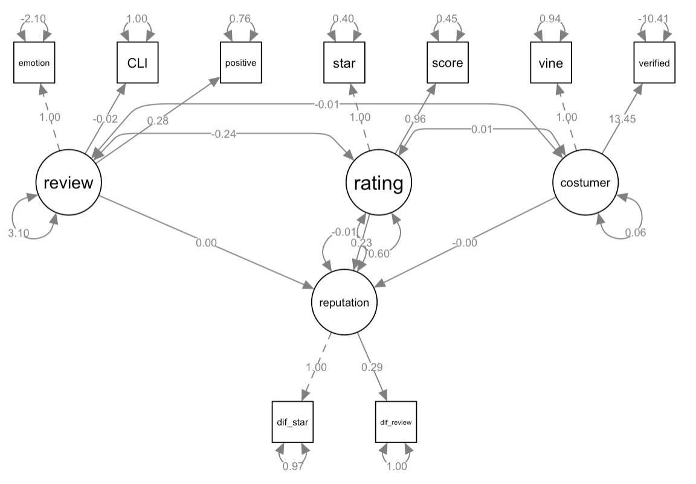

```{r setup, include=FALSE}
knitr::opts_chunk$set(echo = FALSE, message = FALSE, warning = FALSE)
library(knitr)
library(ggplot2)
library(tidyverse)
library(dplyr)
library(patchwork)
library(lubridate)
library(tidytext)
library(textdata)
library(tidyr)
library(plotly)
library(semPlot)
library(lavaan)
library(gmodels)
```

```{r}
hair_dryer = read.csv("hair_dryer.tsv", sep = "\t")
microwave = read.csv("microwave.tsv", sep = "\t")
pacifier = read.csv("pacifier.tsv", sep = "\t")
all = rbind(mutate(hair_dryer, group = "hair_dryer"), 
            mutate(microwave, group = "microwave"),
            mutate(pacifier, group = "pacifier"))
```

# 1

## 数据探索

```{r}
dat = all
p1 = dat %>% 
  ggplot(aes(x = star_rating)) +
  geom_bar(stat = "count", fill = "#ff9900") +
  facet_grid(col = vars(group))
  
dat$review_date = mdy(dat$review_date)

p2 = ggplot(dat, aes(x = review_date, y = star_rating)) +
  geom_point(color = "#ff9900", alpha = 0.01, shape = 11) +
  scale_x_date() +
  geom_smooth(color = "#146eb4") +
  facet_grid(col = vars(group))
```

```{r fig.align="center",out.width="99%",fig.cap="Relationship between star rating and review date"}
p1 / p2
```

（此处对整个亚马逊市场三种产品的评分概况进行下简要分析。）

```{r fig.align="center",out.width="99%",fig.cap="percentage of star rating in different categories of costomers"}
dat = all
dat$vine = dat$vine %>% 
  fct_collapse(vine_Yes = c("Y", "y"), vine_No = c("N", "n"))
dat$verified_purchase = dat$verified_purchase %>% 
  fct_collapse(Yes = c("Y", "y"), No = c("N", "n")) 
dat$star_rating = as.factor(dat$star_rating)

dat %>% 
  ggplot(aes(x = verified_purchase)) +
  geom_bar(aes(fill = star_rating), position = "fill") +
  facet_grid(cols = vars(vine)) +
  labs(y = "percentage")
```

### star rating and helpful rate

```{r}
dat = all
dat$vine = dat$vine %>% 
  fct_collapse(vine_Yes = c("Y", "y"), vine_No = c("N", "n"))
dat$verified_purchase = dat$verified_purchase %>% 
  fct_collapse(purchase_Yes = c("Y", "y"), purchase_No = c("N", "n")) 
dat = dat %>% 
  mutate(helpful_rate = NA)
for(i in 1:nrow(dat))
{
  if(dat$total_votes[i] != 0)
  {
    dat$helpful_rate[i] = dat$helpful_votes[i] / dat$total_votes[i]
  }
}
dat_helpful = dat
dat = dat %>% 
  na.omit() %>% 
  group_by(group, star_rating) %>% 
  summarise(average_helpful_rate = mean(helpful_rate), sum_total_votes = sum(total_votes))

p1 = dat %>% 
  ggplot(aes(x = star_rating, y = sum_total_votes)) +
  geom_col(position = "dodge", fill = "#ff9900") 

p2 = dat %>% 
  ggplot(aes(x = star_rating, y = average_helpful_rate)) +
  geom_col(position = "dodge", fill = "#146eb4") 

dat = dat_helpful
dat = dat %>% 
  na.omit() %>% 
  group_by(group, vine, verified_purchase, star_rating) %>% 
  summarise(average_helpful_rate = mean(helpful_rate), sum_total_votes = sum(total_votes))

p3 = dat %>% 
  ggplot(aes(x = star_rating, y = sum_total_votes)) +
  geom_col(aes(fill = group), position = "dodge") +
  facet_grid(cols = vars(verified_purchase), rows = vars(vine))

p4 = dat %>% 
  ggplot(aes(x = star_rating, y = average_helpful_rate)) +
  geom_col(aes(fill = group), position = "dodge") +
  facet_grid(cols = vars(verified_purchase), rows = vars(vine))

(p2 + p4) / (p1 + p3)
```

从上面那张加和图可以看出：

由于审核过程使用五点星标，因此许多希望表达冷漠态度的评论者会选择三星级（中间选项）。例如，在他们分析亚马逊上的图书的在线评论时（引用Forman2008年）发现，冷漠的评分（大约三颗星）比极端评级（一星/五星）更加深得人心。换句话说，单方面评论（仅指任一积极或消极方面）被认为更有帮助，比适中的评论要好。

然而不仅如此，我们发现，尽管在认可度（投票中的有用性）上，各星级其实相差不远，但是，在投票的总量上，一星和五星明显要更多。这说明评论的观众更关注极端的评论。


## 检验会员是否比非会员更加受到别人信赖（verified_purshase 同理）


# a

此题问的是 最有用的测量指标，以方便新品上市后进行追踪。如评论的情绪总量、差评占比等。

```{r eval=FALSE, include=FALSE}
#for(i in c("hair_dryer.tsv", "microwave.tsv", "pacifier.tsv"))
text_df = tibble(line = 1: nrow(all), text = as.character(all$review_body), group = all$group)
tidy_df = text_df %>% 
  unnest_tokens(word, text) %>% 
  anti_join(stop_words)

bing_word_counts <- tidy_df %>%
  group_by(group) %>% 
  count(word, sort = TRUE) %>%
  ungroup() %>% 
  bind_tf_idf(word, group, n)

special_hair_dryer = bing_word_counts %>%
  filter(group == "hair_dryer") %>% 
  top_n(10) %>%
  mutate(word = reorder(word, tf_idf)) %>% 
  select(group, word, tf_idf)

special_pacifier = bing_word_counts %>%
  filter(group == "pacifier") %>% 
  top_n(10) %>%
  mutate(word = reorder(word, tf_idf)) %>% 
  select(group, word, tf_idf)

special_microwave = bing_word_counts %>%
  filter(group == "microwave") %>% 
  top_n(10) %>%
  mutate(word = reorder(word, tf_idf)) %>% 
  select(group, word, tf_idf)

#table = cbind(special_hair_dryer, special_microwave, special_pacifier)
#write.csv(table, "special.csv")

dat = rbind(special_hair_dryer, special_microwave, special_pacifier)
dat$word = as.character(dat$word)
a = dat %>% 
  filter(group == "hair_dryer") %>% 
  mutate(word = reorder(word, tf_idf))
pa =  a %>% 
  ggplot(aes(x = word, y = tf_idf)) +
  geom_col(fill = "#146eb4") +
  coord_flip()

b = dat %>% 
  filter(group == "microwave") %>% 
  mutate(word = reorder(word, tf_idf))
pb =  b %>% 
  ggplot(aes(x = word, y = tf_idf)) +
  geom_col(fill = "#146eb4") +
  coord_flip()

c = dat %>% 
  filter(group == "pacifier") %>% 
  mutate(word = reorder(word, tf_idf))
pc = c %>% 
  ggplot(aes(x = word, y = tf_idf)) +
  geom_col(fill = "#146eb4") +
  coord_flip()

pa + pb + pc
```

```{r fig.align="center",out.width="99%",fig.cap="the most important words in the review of three products"}
bing = get_sentiments("bing")
bing$sentiment[which(bing$word == "cheap")] = "positive"

text_df = tibble(line = 1: nrow(hair_dryer), text = as.character(hair_dryer$review_body))
tidy_df = text_df %>% 
  unnest_tokens(word, text) %>% 
  anti_join(stop_words)

bing_word_counts <- tidy_df %>%
  inner_join(bing) %>%
  count(word, sentiment, sort = TRUE) %>%
  ungroup() %>% 
  bind_tf_idf(word, sentiment, n)

p1 = bing_word_counts %>%
  group_by(sentiment) %>%
  top_n(10) %>%
  ungroup() %>%
  mutate(word = reorder(word, tf_idf)) %>%
  ggplot(aes(word, tf_idf, fill = sentiment)) +
  geom_col(show.legend = FALSE) +
  facet_grid(row = vars(sentiment), scales = "free_y") +
  labs(y = "tf-idf", x = NULL, title = "hair_dryer") +
  theme(plot.title = element_text(hjust = 0.5)) +
  coord_flip()

text_df = tibble(line = 1: nrow(microwave), text = as.character(microwave$review_body))
tidy_df = text_df %>% 
  unnest_tokens(word, text) %>% 
  anti_join(stop_words)

bing_word_counts <- tidy_df %>%
  inner_join(bing) %>%
  count(word, sentiment, sort = TRUE) %>%
  ungroup() %>% 
  bind_tf_idf(word, sentiment, n)

p2 = bing_word_counts %>%
  group_by(sentiment) %>%
  top_n(10) %>%
  ungroup() %>%
  mutate(word = reorder(word, tf_idf)) %>%
  ggplot(aes(word, tf_idf, fill = sentiment)) +
  geom_col(show.legend = FALSE) +
  facet_grid(row = vars(sentiment), scales = "free_y") +
  labs(y = "tf-idf", x = NULL, title = "microwave") +
  theme(plot.title = element_text(hjust = 0.5)) +
  coord_flip()

text_df = tibble(line = 1: nrow(pacifier), text = as.character(pacifier$review_body))
tidy_df = text_df %>% 
  unnest_tokens(word, text) %>% 
  anti_join(stop_words)

bing_word_counts <- tidy_df %>%
  inner_join(bing) %>%
  count(word, sentiment, sort = TRUE) %>%
  ungroup() %>% 
  bind_tf_idf(word, sentiment, n)

p3 = bing_word_counts %>%
  group_by(sentiment) %>%
  top_n(10) %>%
  ungroup() %>%
  mutate(word = reorder(word, tf_idf)) %>%
  ggplot(aes(word, tf_idf, fill = sentiment)) +
  geom_col(show.legend = FALSE) +
  facet_grid(row = vars(sentiment), scales = "free_y") +
  labs(y = "tf-idf", x = NULL, title = "pacifier") +
  theme(plot.title = element_text(hjust = 0.5)) +
  coord_flip()

p1 + p2 + p3
```


## 投票有用性回归

```{r eval=FALSE, include=FALSE}
dat = read.csv("one_all.csv", stringsAsFactors = FALSE)
names(dat)[4] = "star_rating"
dat$CLI = dat$CLI%>% 
  as.numeric() 
dat = dat %>% 
  mutate(star_rating_square = star_rating^2) %>% 
  mutate(time_difference_log = log(time_difference)) %>% 
  mutate(emotion_polarity_square = emotion_polarity^2) %>% 
  mutate(emotion_total_square = emotion_total^2) %>% 
  mutate(CLI_square = CLI^2)
dat = na.omit(dat) 

# 单独回归
m = lm(HR ~ CLI_square, dat)
#summary(m)

# 逐步回归
#m1 = lm(HR ~ . , dat)
#step(m1)

# 普通回归
m2 = lm(formula = HR ~ emotion_total + time_difference + vine + CLI + 
    rating_square + time_difference_log + emotion_total_square + 
    CLI_square, data = dat)

m4 = lm(HR ~ CLI + CLI_square  + star_rating_square + emotion_total + emotion_total_square, data = dat)

# Tobit
#library(VGAM)
#m4 = vglm(HR ~ CLI_square + emotion_total + rating + rating_square, tobit(Upper = 800), data = dat)
#summary(m4)

#shapiro.test(residuals(m1))
```

```{r eval=FALSE, include=FALSE}
# fit model
m <- lm(HR ~ CLI + CLI_square + star_rating + star_rating_square, data = dat)
sum$coefficients %>% 
   kable(caption = "Regression Coefficients for the regression model", digits = 2)
summary(m)
coef = m$coefficients
Star_Rate = seq(0, 5, by = 0.1)
CLI = seq(-200, 200, by = 8)
Helpful_Rate = matrix(nrow = 50, ncol = 50)
for(i in 1:50)
{
  for(j in 1:50)
  {
    Helpful_Rate[i,j] = coef[4] * Star_Rate[j] + coef[5] * Star_Rate[j]^2 + coef[2] * CLI[i] + coef[3] * CLI[i]^2 + coef[1]
  }
}
plot_ly() %>% 
  add_surface(x = Star_Rate, y = CLI, z = Helpful_Rate) %>% 
  layout(
    title = "Layout options in a 3d scatter plot",
    scene = list(
      xaxis = list(title = "Star Rate"),
      yaxis = list(title = "CLI"),
      zaxis = list(title = "Helpful Rate")
    ))
```

插入 3D 回归图像

# b

此题问的是 衡量指标和哪种形势下可能暗示着产品在下滑或上升。如当negative的评论增多时，可能分数现在不会马上下降，但未来下降。

```{r eval=FALSE, include=FALSE}
dat = rbind(hair_dryer, microwave, pacifier)
dat$review_date = mdy(dat$review_date)
dat$review_date = year(dat$review_date)
  
volumn = dat %>% 
  group_by(product_parent, review_date) %>% 
  summarise(volumn = n())

dat = dat %>% 
  group_by(product_parent, review_date) %>% 
  summarise(star_rating = mean(star_rating)) %>% 
  cbind(volumn = volumn$volumn)

low = unique(dat$product_parent)[10]
high = unique(dat$product_parent)[15]

dat %>% 
  filter(product_parent == 2775015)
dat  = dat %>% 
  filter(product_parent < high & product_parent > low)
p1 = ggplot(dat) +
  geom_col(aes(x = review_date, y = star_rating)) +
  facet_grid(col = vars(product_parent))

p2 = ggplot(dat) +
  geom_line(aes(x = review_date, y = volumn)) +
  facet_grid(col = vars(product_parent))

p1 / p2
```

# c 结构方程

```{r}
dat = all %>% 
  mutate(line = 1:nrow(all))
dat$review_date = mdy(dat$review_date)
dat$review_date = year(dat$review_date)

# Calculate Emotion
bing = read.csv("bing.csv")
bing_positive = bing %>% 
  filter(sentiment == "positive")
text_df = tibble(line = 1: nrow(all), text = as.character(all$review_body))
positive_df = text_df %>% 
  unnest_tokens(word, text) %>% 
  anti_join(stop_words) %>% 
  inner_join(bing_positive) %>% 
  group_by(line) %>% 
  summarise(positive = n())
total_df = text_df %>% 
  unnest_tokens(word, text) %>% 
  anti_join(stop_words) %>% 
  inner_join(bing) %>% 
  group_by(line) %>% 
  summarise(total = n())
dat = dat %>% 
  left_join(positive_df, by = "line") %>% 
  left_join(total_df, by = "line")
```

```{r}
# Calculate Increase
count = dat %>% 
  group_by(product_parent, review_date) %>% 
  summarise(star_rating_mean = mean(star_rating), review_number = n()) %>% 
  mutate(star_rating_mean_increase = NA) %>% 
  mutate(review_number_increase = NA)

for(i in 2:(nrow(count)))
{
  if(count$product_parent[i] == count$product_parent[i-1])
  {
    count$star_rating_mean_increase[i] = count$star_rating_mean[i] - count$star_rating_mean[i-1]
    count$review_number_increase[i] = count$review_number[i] - count$review_number[i-1]
  }
}

dat = dat %>% 
  left_join(count, by = c("product_parent", "review_date"))
```

```{r}
# Combine
one_three_all = read.csv("one_three_all.csv")
dat = cbind(dat, CLI = one_three_all$CLI)

hair_dryer_predict_new = read.csv("hair_dryer_predict_new.csv")
microwave_predict_new = read.csv("microwave_predict_new.csv")
pacifier_predict_new = read.csv("pacifier_predict_new.csv")
score = rbind(hair_dryer_predict_new, microwave_predict_new, pacifier_predict_new)
dat = dat %>% 
  cbind(score = score$predict)
dat = dat %>% 
  filter(CLI < 1000 & CLI > -1000)
dat$vine = as.numeric(dat$vine)
dat$verified_purchase = as.numeric(dat$verified_purchase)
dat = na.omit(dat)
```

```{r}
#Scale
dat = dat %>% 
  select(star_rating_mean_increase, review_number_increase, total, CLI, positive, star_rating, score, vine, verified_purchase)
names(dat) = c("dif_star", "dif_review", "emotion", "CLI", "positive", "star", "score", "vine", "verified")
dat = scale(dat)

model <- '
   # latent variables
     reputation =~ dif_star + dif_review
     review =~ emotion + CLI + positive
     rating =~ star + score
     costumer =~ vine + verified
   # regressions
     reputation ~ review + rating + costumer

   # residual covariances
'
fit = sem(model, data=dat)
Eval2 = fitMeasures(fit, c("aic","bic" ,"cfi","rmsea","srmr"))
r2 = inspect(fit, 'r2')
```

```{r}
#summary(fit)
```

```{r eval=FALSE, include=FALSE}
semPaths(fit)
semPaths(fit, what='std', nCharNodes=10, sizeMan=10,
         edge.label.cex=0.6, curvePivot = TRUE, fade=FALSE)
semPaths(fit,whatLabels="par", intercepts=FALSE, 
         nCharNodes=0, residuals =TRUE,
         nCharEdges=0, curveAdjacent = TRUE,title=TRUE,
         layout="tree2",curvePivot=TRUE)
```

```{r fig.align="center",out.width="90%",fig.cap="Structural equation model"}

```

# d

此题问的是 特定的星级是否会激起更多的评论。例如，评分两级分化的产品评论数更多。

```{r fig.align="center",out.width="99%",fig.cap="figure caption"}
dat = read.csv("2d_all_emotion.csv")

dat = dat%>% 
  mutate(rate = rate4 + rate5) %>% #--- 更改自变量
  filter(emotion > 0) %>% 
  mutate(log_emotion = log(emotion))

dat = dat[-which(dat$rate == 0),]
dat = dat[-which(dat$rate == 1),]

ggplot(dat, aes(x = rate, y = log_emotion)) + #--- x y 的参数调换可以更改 x y 轴
  geom_point(color = "#FF9900", alpha = 0.1) +
  geom_smooth(color = "#146eb4", method = lm) +
  facet_grid(col = vars(group))

dat_hair_dryer = dat %>% 
  filter(group == "hair_dryer")
m1 = lm(log_emotion ~ rate, data = dat_hair_dryer)

dat_microwave = dat %>% 
  filter(group == "microwave")
m2 = lm(log_emotion ~ rate, data = dat_microwave)

dat_pacifier = dat %>% 
  filter(group == "pacifier")
m3 = lm(log_emotion ~ rate, data = dat_pacifier)

# stargazer(m1, m2, m3, type = 'latex', title="Comparison among 3 models")
```

\begin{table}[!htbp] \centering 
  \caption{Regression of Y on X for three products} 
  \label{} 
\begin{tabular}{@{\extracolsep{5pt}}lccc} 
\\[-1.8ex]\hline 
\hline \\[-1.8ex] 
 & \multicolumn{3}{c}{\textit{Dependent variable:}} \\ 
\cline{2-4} 
\\[-1.8ex] & \multicolumn{3}{c}{log\_emotion} \\ 
\\[-1.8ex] & (1) & (2) & (3)\\ 
\hline \\[-1.8ex] 
 rate & 1.222$^{***}$ & $-$0.262$^{**}$ & 5.048$^{***}$ \\ 
  & (0.102) & (0.114) & (0.108) \\ 
  & & & \\ 
 Constant & 4.654$^{***}$ & 4.859$^{***}$ & 0.757$^{***}$ \\ 
  & (0.078) & (0.075) & (0.087) \\ 
  & & & \\ 
\hline \\[-1.8ex] 
Observations & 9,978 & 1,303 & 8,651 \\ 
R$^{2}$ & 0.014 & 0.004 & 0.202 \\ 
Adjusted R$^{2}$ & 0.014 & 0.003 & 0.202 \\ 
Residual Std. Error & 1.230 (df = 9976) & 1.025 (df = 1301) & 1.383 (df = 8649) \\ 
F Statistic & 143.482$^{***}$ & 5.298$^{**}$ & 2,192.962$^{***}$ \\ 
\hline 
\hline \\[-1.8ex] 
\textit{Note:}  & \multicolumn{3}{r}{$^{*}$p$<$0.1; $^{**}$p$<$0.05; $^{***}$p$<$0.01} \\ 
\end{tabular} 
\end{table} 

# e

此题问的是 评论中特定的性质的描述词是否会与评分高度相关。

我们将评论内容进行分词。

将情感词通过情感词表筛选出来，计算情感中包含特定情绪：joy trust surprise anticipation 的比例(level)

将每一条评论作为一个观测，level作为自变量，评分(star_rate)作为因变量，三个数据集分别进行作出图像。

```{r fig.align="center",out.width="99%",fig.cap="relationship between star rating and proportion of specific quality descriptors"}
nrc = read.csv("nrc.csv")
nrc_joy = nrc %>% 
  filter(sentiment == "joy" | sentiment == "trust" | sentiment == "surprise" | sentiment == "anticipation")

text_df = tibble(line = 1: nrow(hair_dryer), text = as.character(hair_dryer$review_body))
partial_df = text_df %>% 
  unnest_tokens(word, text) %>% 
  anti_join(stop_words) %>% 
  inner_join(nrc_joy) %>% 
  group_by(line) %>% 
  summarise(partial = n())
total_df = text_df %>% 
  unnest_tokens(word, text) %>% 
  anti_join(stop_words) %>% 
  inner_join(nrc) %>% 
  group_by(line) %>% 
  summarise(total = n())
tidy_df = partial_df %>% 
  inner_join(total_df, by = "line") %>% 
  mutate(proportion = partial / total)
regression = hair_dryer %>% 
  dplyr::select(star_rating) %>% 
  mutate(line = 1:nrow(hair_dryer)) %>% 
  left_join(tidy_df, by = "line")
regression = regression[-which(regression$proportion == 1),]
regression = na.omit(regression)
dat1 = regression %>% 
  mutate(group = "hair_dryer")
m1 = lm(star_rating ~ proportion, regression)

text_df = tibble(line = 1: nrow(microwave), text = as.character(microwave$review_body))
partial_df = text_df %>% 
  unnest_tokens(word, text) %>% 
  anti_join(stop_words) %>% 
  inner_join(nrc_joy) %>% 
  group_by(line) %>% 
  summarise(partial = n())
total_df = text_df %>% 
  unnest_tokens(word, text) %>% 
  anti_join(stop_words) %>% 
  inner_join(nrc) %>% 
  group_by(line) %>% 
  summarise(total = n())
tidy_df = partial_df %>% 
  inner_join(total_df, by = "line") %>% 
  mutate(proportion = partial / total)
regression = microwave %>% 
  dplyr::select(star_rating) %>% 
  mutate(line = 1:nrow(microwave)) %>% 
  left_join(tidy_df, by = "line")
regression = regression[-which(regression$proportion == 1),]
regression = na.omit(regression)
dat2 = regression %>% 
  mutate(group = "microwave")
m2 = lm(star_rating ~ proportion, regression)

text_df = tibble(line = 1: nrow(pacifier), text = as.character(pacifier$review_body))
partial_df = text_df %>% 
  unnest_tokens(word, text) %>% 
  anti_join(stop_words) %>% 
  inner_join(nrc_joy) %>% 
  group_by(line) %>% 
  summarise(partial = n())
total_df = text_df %>% 
  unnest_tokens(word, text) %>% 
  anti_join(stop_words) %>% 
  inner_join(nrc) %>% 
  group_by(line) %>% 
  summarise(total = n())
tidy_df = partial_df %>% 
  inner_join(total_df, by = "line") %>% 
  mutate(proportion = partial / total)
regression = pacifier %>% 
  dplyr::select(star_rating) %>% 
  mutate(line = 1:nrow(pacifier)) %>% 
  left_join(tidy_df, by = "line")
regression = regression[-which(regression$proportion == 1),]
regression = na.omit(regression)
dat3 = regression %>% 
  mutate(group = "pacifier")
m3 = lm(star_rating ~ proportion, regression)

dat = rbind(dat1, dat2, dat3)
dat %>% 
  ggplot(aes(x = proportion, y = star_rating)) +
  geom_point(color = "#ff9900", alpha = 0.04, shape = 11) + 
  geom_smooth(color = "#146eb4") +
  facet_wrap(vars(group))
# stargazer(m1, m2, m3, type = 'latex', title="Regression of star rating on proportion of specific quality descriptors")
```


可见平滑拟合曲线有着很明显的趋势。我们再对三个数据集分别进行线性回归。

\begin{table}[!htbp] \centering 
  \caption{Regression of star rating on proportion of specific quality descriptors for three products} 
  \label{} 
\begin{tabular}{@{\extracolsep{5pt}}lccc} 
\\[-1.8ex]\hline 
\hline \\[-1.8ex] 
 & \multicolumn{3}{c}{\textit{Dependent variable:}} \\ 
\cline{2-4} 
\\[-1.8ex] & \multicolumn{3}{c}{star\_rating} \\ 
\\[-1.8ex] & (1) & (2) & (3)\\ 
\hline \\[-1.8ex] 
 proportion & 2.108$^{***}$ & 2.948$^{***}$ & 1.615$^{***}$ \\ 
  & (0.087) & (0.279) & (0.063) \\ 
  & & & \\ 
 Constant & 3.202$^{***}$ & 2.061$^{***}$ & 3.553$^{***}$ \\ 
  & (0.041) & (0.131) & (0.031) \\ 
  & & & \\ 
\hline \\[-1.8ex] 
Observations & 7,988 & 1,195 & 14,540 \\ 
R$^{2}$ & 0.069 & 0.086 & 0.043 \\ 
Adjusted R$^{2}$ & 0.069 & 0.085 & 0.043 \\ 
Residual Std. Error & 1.246 (df = 7986) & 1.594 (df = 1193) & 1.149 (df = 14538) \\ 
F Statistic & 590.479$^{***}$ & 112.051$^{***}$  & 657.771$^{***}$  \\ 
\hline 
\hline \\[-1.8ex] 
\textit{Note:}  & \multicolumn{3}{r}{$^{*}$p$<$0.1; $^{**}$p$<$0.05; $^{***}$p$<$0.01} \\ 
\end{tabular} 
\end{table} 

可以看到，由于评分是整数，这使得模型的 $R^2$ 偏小。但拟合得到的自变量都非常显著，且整个模型 F-test 的 p-value 都非常小。


# 安坤辰箱线图

```{r}
dat = read.csv("tfidf_spatial_distance.csv")
ggplot(dat) +
  geom_boxplot(aes(x = as.factor(score), y = distance)) +
  labs(x = "star_rating", y = "tf-idf distance")

ggplot(dat) +
  geom_violin(aes(x = as.factor(score), y = distance), fill = "#ff9900") +
  labs(x = "star_rating", y = "tf-idf distance") +
  geom_smooth(aes(x = score, y = distance), method = "glm", color = "#146eb4") +
  theme_minimal()
```


# 有用段落：来自英文论文（copy要改写一下）

Furthermore, Pavlou and Dimoka 2006 also found that ex- tremely positive or negative ratings of eBay sellers were assessed as more informative than moderate ratings. This latter finding may be explained by the interplay between purchase intention, which has a binary outcome (to purchase or not), and the forma- tion of a consideration set (Shocker et al. 1991). A product review that presents a one-sided argument (in favor of or against pur- chase) is considered more helpful in a search process, since it elim- inates or strengthens the position of the product with regards to the list of alternatives or items in a consideration set. 


# p

```{r include=FALSE}
dat = read.csv("special_in_type.csv")

index = dat %>% 
  group_by(group, Attributes) %>% 
  summarise(tf_idf = sum(tf_idf) * 1000) %>% 
  group_by(group) %>% 
  mutate(Attributes = reorder(Attributes, tf_idf))

p1 = index %>% 
  filter(group == "hair dryer") %>% 
  mutate(Attributes = reorder(Attributes, tf_idf)) %>% 
  ggplot() +
  geom_col(aes(x = Attributes, y = tf_idf), fill = "#ff9900") +
  coord_flip() + 
  labs(title = "hair dryer", y = "Importent Index") +
  theme_minimal()

p2 = index %>% 
  filter(group == "microwave") %>% 
  mutate(Attributes = reorder(Attributes, tf_idf)) %>% 
  ggplot() +
  geom_col(aes(x = Attributes, y = tf_idf), fill = "#ff9900") +
  coord_flip() + 
  labs(title = "microwave", y = "Importent Index", x = NULL) +
  theme_minimal()

p3 = index %>% 
  filter(group == "pacifier") %>% 
  mutate(Attributes = reorder(Attributes, tf_idf)) %>% 
  ggplot() +
  geom_col(aes(x = Attributes, y = tf_idf), fill = "#ff9900") +
  coord_flip() + 
  labs(title = "pacifier", y = "Importent Index", x = NULL) +
  theme_minimal()
```


```{r echo=FALSE, fig.cap='The most importent attributes in the reviews of three commodities', warning=FALSE, out.width='99%'}
p = (p1 + p2 + p3)
```


